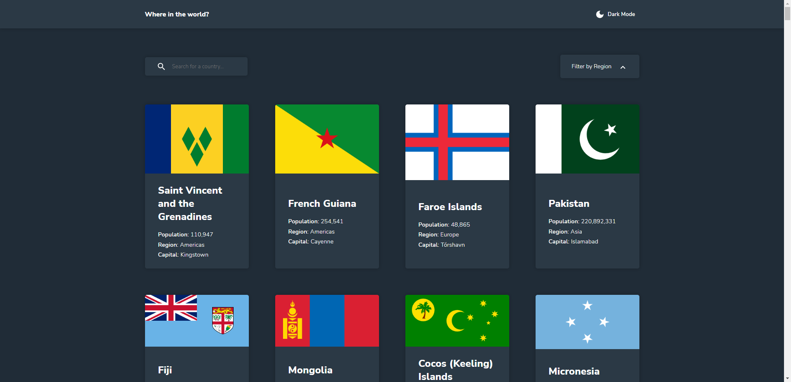

# Frontend Mentor - REST Countries API with color theme switcher solution

This is a solution to the [REST Countries API with color theme switcher challenge on Frontend Mentor](https://www.frontendmentor.io/challenges/rest-countries-api-with-color-theme-switcher-5cacc469fec04111f7b848ca). Frontend Mentor challenges help you improve your coding skills by building realistic projects. 

## Table of contents

- [Overview](#overview)
  - [The challenge](#the-challenge)
  - [Screenshot](#screenshot)
  - [Links](#links)
- [My process](#my-process)
  - [Built with](#built-with)
  - [What I learned](#what-i-learned)
  - [Continued development](#continued-development)
  - [Useful resources](#useful-resources)
- [Author](#author)

## Overview

### The challenge

Users should be able to:

- See all countries from the API on the homepage
- Search for a country using an `input` field
- Filter countries by region
- Click on a country to see more detailed information on a separate page
- Click through to the border countries on the detail page
- Toggle the color scheme between light and dark mode *(optional)*

### Screenshot



### Links

- Solution URL: [Add solution URL here](https://your-solution-url.com)
- Live Site URL: [Add live site URL here](https://your-live-site-url.com)

## My process

### Built with

- Semantic HTML5 markup
- CSS custom properties
- Flexbox
- CSS Grid
- [React](https://reactjs.org/) - JS library
- [Sass](https://sass-lang.com/) - CSS preprocessor

### What I learned

I came across an issue with a component trying to get data before it was fetched. After a little googling, I learned that I can just use React.lazy and the Suspense component to delay the rendering until after the data gets fetched.

```js
const Home = React.lazy(() => import("./pages/Home"));
const CountryDetails = React.lazy(() => import("./pages/CountryDetails"));

<Route path="/" element={
    <Suspense fallback={ <h1>Loading...</h1> }>
        <Home/>
    </Suspense>
}/>
<Route path="/country/:id" element={
    <Suspense fallback={ <h1>Loading...</h1> }>
        <CountryDetails/>
    </Suspense>
}/>
```

### Continued development

I would like to continue working on my React and CSS skills.

### Useful resources

- [React JS Docs Suspense](https://17.reactjs.org/docs/concurrent-mode-suspense.html) - This helped me figure out how to fix an issue where a component would try and get data that has not been fetched yet.
- [WDS React Router Tutorial](https://www.youtube.com/watch?v=Ul3y1LXxzdU) - This video from WDS helped me understand how react router works so I could do this challenge and future projects that may need it.

## Author

- Frontend Mentor - [@liquidwater0](https://www.frontendmentor.io/profile/liquidwater0)